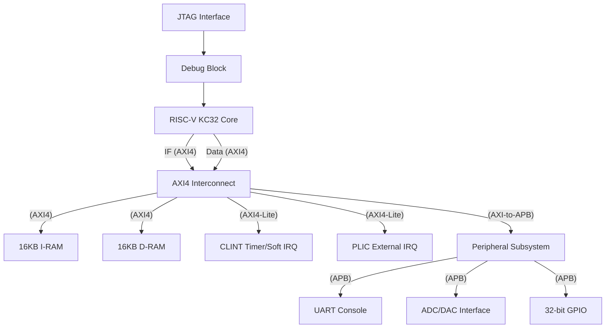

# 🌐 RISC-V 32KC2 System Top-Level

The `riscv32KC2_system` module is the comprehensive top-level integration of the entire SoC. It orchestrates the RISC-V CPU core, high-performance AXI4 interconnect, debug infrastructure, and a rich set of memory and peripheral subsystems.

---

## 🏛️ System Architecture

The SoC follows a hierarchical AXI/APB topology designed for high-performance instruction/data movement and low-power peripheral access.

---

## 🛠️ Integrated Components

### 1. RISC-V Core & Interrupts
- **CPU Core (`riscv_core`):** 2-stage pipeline (Stage 1: IF/ID | Stage 2: EX/MEM/WB) with dual AXI4 master ports.
- **CLINT (`axi_riscv_clint`):** Standard Core Local Interruptor providing machine-mode timer and software interrupts.
- **PLIC (`axi_riscv_plic`):** Platform-Level Interrupt Controller for up to 32 prioritized external interrupt sources.

### 2. Memory Subsystem
- **Instruction RAM:** 16KB high-speed code storage mapped to `0x7000_0000`.
- **Data RAM:** 16KB high-speed data storage mapped to `0x9000_0000`.
- **Boot ROM:** 256-byte ROM at `0x0000_1000` containing the jump-to-IRAM bootloader.

### 3. Peripheral Subsystem
A unified I/O hub bridging AXI to APB:
- **UART:** High-speed serial console at `0x1000_0000`.
- **ADC/DAC:** 12-bit ADC and 3-channel 16-bit DAC at `0x1000_1000`.
- **GPIO:** 32 configurable pins with interrupt support at `0x1000_2000`.

---

## 🗺️ System Address Map

| Range | Component | Description |
| :--- | :--- | :--- |
| `0x0000_0800` - `0x0000_0FFF` | **Debug** | DM Registers (0.13 Spec). |
| `0x0000_1000` - `0x0000_7FFF` | **Boot ROM** | 256B Mask ROM (Entry Point). |
| `0x0200_0000` - `0x0200_FFFF` | **CLINT** | Timer & Software Interrupts. |
| `0x0C00_0000` - `0x0C03_FFFF` | **PLIC** | External Interrupt Controller. |
| `0x1000_0000` - `0x1000_0FFF` | **UART** | Serial Console Registers. |
| `0x1000_1000` - `0x1000_1FFF` | **ADC/DAC** | Mixed-Signal I/O Control. |
| `0x1000_2000` - `0x1000_2FFF` | **GPIO** | Digital GPIO Control. |
| `0x7000_0000` - `0x8FFF_FFFF` | **IRAM** | 16 KB Code Memory (AXI4). |
| `0x9000_0000` - `0xAFFF_FFFF` | **DRAM** | 16 KB Data Memory (AXI4). |

---

## 🚀 Boot Sequence

1.  **Reset:** The core initializes with PC set to `0x0000_1000` (Boot ROM).
2.  **Redirect:** The Boot ROM executes a hardcoded jump to the I-RAM entry point at `0x7000_0000`.
3.  **Execute:** The core begins running user firmware from the high-speed code memory.

---

## 📜 Related Documents
- [**Main Project README**](../../README.md)
- [**Core Implementation**](../riscv_core/README.md)
- [**Bus Infrastructure**](../bus/README.md)
- [**Peripheral Subsystem**](../peripheral/README.md)

